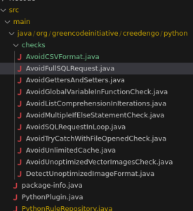
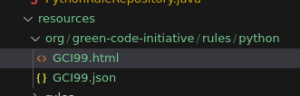
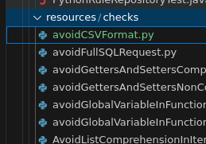
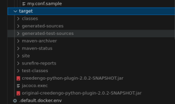
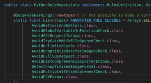
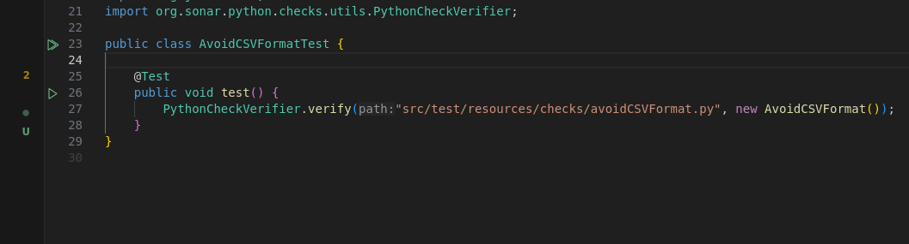
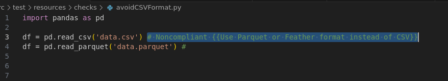
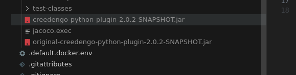

Prérequis :
JDK (Java Development Kit)
sudo apt install openjdk-17-jdk -y
Test : java -version

Docker
Suivez les instructions d'installation : https://docs.docker.com/engine/install/debian/#install-using-the-repository 

Test : sudo docker run hello-world

Maven
sudo apt install maven -y
Test : mvn -v

Présentation du projet Creedengo Python
Pour commencer à développer des règles pour Python, il nous faut un projet Maven qui permet de faire des règles custom pour Sonar. Dans cet exemple, on va prendre celui de Creedengo, mais on pourrait le faire from scratch en suivant ce tutoriel : https://docs.sonarsource.com/sonarqube-server/latest/analyzing-source-code/languages/python/#custom-rules

Pour le cloner et y accéder :

git clone https://github.com/green-code-initiative/creedengo-python.git
cd creedengo-python
code .
Les règles sont à écrire ici : src/main/java/org/greencodeinitiative/creedengo/python/checks/

Les métadonnées (JSON) et ce qu'on affiche dans les détails de la règle sur Sonar (HTML) sont à écrire ici : src/main/resources/org/green-code-initiative/rules/python

Les tests pour chaque règle sont à mettre ici : src/test/java/org/greencodeinitiative/creedengo/python/checks/

Les fichiers Python pour les tests se trouvent ici : src/test/resources/checks

Une fois compilées, vos règles seront disponibles dans le dossier target sous forme de JAR.

Créer sa première règle
Maintenant qu'on a vu l'ensemble du repo nous allons voir comment créer une règle.

1er étape : Créer la règle en Java
Rendez-vous dans src/main/java/org/greencodeinitiative/creedengo/python/checks
Copiez une règle existante pour avoir la structure de base
À changer :
@Rule(key = "GCI99") # Pensez à changer l'identifiant de la règle
visitCallExpression # Changer la logique de la règle pour l'adapter à votre besoin
2ème étape : Ajouter votre règle à la liste des règles 
Modifiez le fichier src/main/java/org/greencodeinitiative/creedengo/python/PythonRuleRepository.java

3ème étape : Créer les tests unitaires de votre règle
Allez dans src/test/java/org/greencodeinitiative/creedengo/python/checks
Ajoutez la classe qui va effectuer les tests (basez-vous sur une classe existante)
Nommez votre classe de test en ajoutant "Test" à la fin (ex: AvoidCSVFormatTest)

Créez le fichier Python de test dans src/test/resources/checks
Dans ce fichier, précisez les lignes où la règle doit remonter une issue en ajoutant # Noncompliant

4ème Tester sa règle 
Une fois que la règle est créée et que les fichiers de tests sont implémentés, vous pouvez tester directement votre règle grâce à la commande suivante :

mvn clean test -Dtest=AvoidCSVFormatTest -DtrimStack
Cette commande vous permettra non seulement de vérifier le bon fonctionnement de votre règle, mais également de la déboguer, par exemple si vous avez inséré des System.out.println() dans votre code.

mvn : Lance Maven, l'outil de gestion de projet et de construction.

clean : Nettoie le répertoire de sortie (généralement target/) pour s'assurer que vous partez d'un état propre.

test : Exécute la phase de test du cycle de vie Maven.

-Dtest=AvoidCSVFormatTest : Spécifie la classe de test à exécuter. Dans ce cas, il s'agit de AvoidCSVFormatTest. Assurez-vous de remplacer ce nom par celui de votre classe de test si elle est différente.

-DtrimStack : Cette option réduit la taille de la pile d'appels dans les rapports d'erreur, ce qui peut rendre les messages d'erreur plus lisibles.

5ème étape : Ajouter le front et les métadonnées de votre règle

Front (HTML) : Créez un fichier GCI99.html dans src/main/resources/org/green-code-initiative/rules/python/
voici un exemple de contenu du fichier 

Using CSV format for data storage and transfer is less efficient compared to modern formats like Parquet or Feather. These formats save CPU cycles, reduce memory usage, and improve performance.

<h2 id="_non_compliant_code_example">Non compliant Code Example</h2>

<pre class="CodeRay highlight"><code data-lang="python">import pandas as pd

df = pd.read_csv('data.csv') # Noncompliant: Use Parquet or Feather format instead
</code></pre>

<h2 id="_compliant_solution">Compliant Solution</h2>

<pre class="CodeRay highlight"><code data-lang="python">import pandas as pd

df = pd.read_parquet('data.parquet') # Compliant: Parquet format is more efficient
# or
df = pd.read_feather('data.feather') # Compliant: Feather format is more efficient
</code></pre>

Métadonnées (JSON) : Créez un fichier GCI99.json au même endroit
voici un exemple de contenu 

{
"title": "Avoid using CSV format",
"type": "CODE_SMELL",
"status": "ready",
"remediation": {
"func": "Constant\/Issue",
"constantCost": "20min"
},
"tags": [
"eco-design",
"performance",
"network",
"sql",
"creedengo"
],
"defaultSeverity": "Minor"
}

6ème Build le projet Commandes Maven utiles :
mvn clean : supprime le dossier target (les JARs)
mvn compile : crée les classes dans le target
mvn package : compile les tests et crée les JARs
Pour analyser le JAR généré : jar tf fichier.jar
Vous allez exécuter : mvn clean compile

Les jars seront dans le dossier target

7ème Lancer Sonar, ajouter les règles et redémarrer Sonar
Lancez une instance de Sonar sur Docker : ./tool_docker-init.sh
Vérifiez le nom du conteneur : docker ps (normalement sonar_creedengo_python)
Déplacez les JARs dans l'instance :
docker cp ./target/creedengo-python-plugin-2.0.2-SNAPSHOT.jar sonar_creedengo_python:/opt/sonarqube/extensions/plugins/
Arrêtez l'instance de Sonar : ./tool_stop.sh
Redémarrez-la : ./tool_start.sh
Normalement, vous devriez pouvoir retrouver la règle dans le marketplace.

Si elle n'est pas présente, inspectez le fichier JAR :

jar tf fichier.jar
pour vérifier si la règle est bien incluse.

Comment vérifier sa règle ?
Pour cela, nous allons utiliser sonar-scanner. On peut cloner directement ce projet de template : https://github.com/cleophass/sonar-scanner-template

Il faudra suivre les explications dans le README et cela devrait fonctionner.